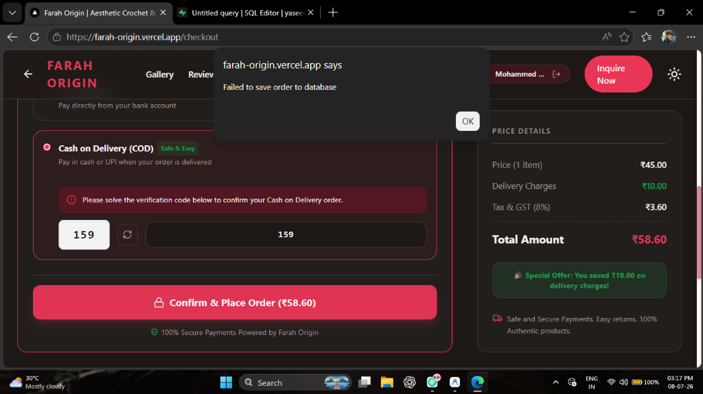
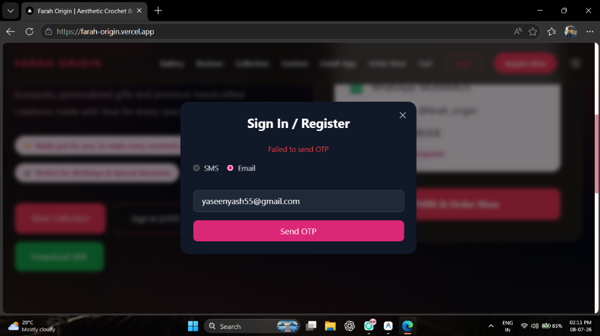
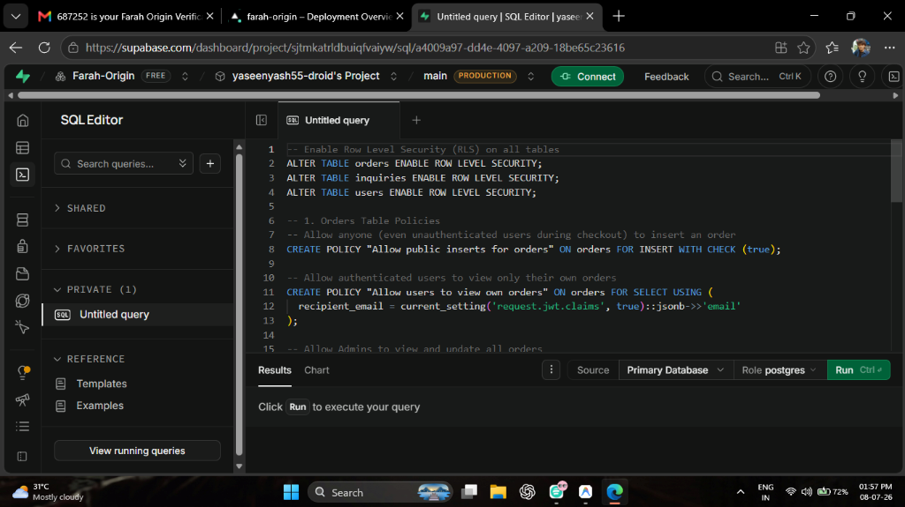
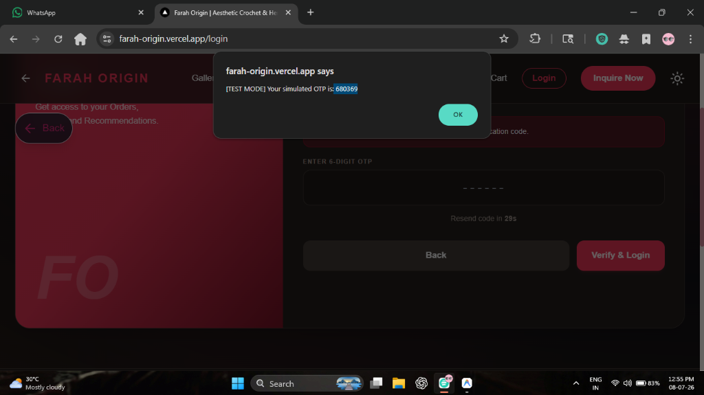

# Farah Origin 🧶 | Project Documentation

Welcome to the official documentation for **Farah Origin**, an Aesthetic Crochet & Henna Atelier platform. This document outlines the architecture, features, and deployment pipeline for the Next.js web application and Android APK.

---

## 1. Project Overview
Farah Origin is a modern e-commerce and portfolio application designed to showcase and sell handcrafted crochet and henna products. It features a stunning, premium user interface (UI) and a fully functional Admin Dashboard for managing inventory and orders.

### Core Features:
- **Aesthetic UI/UX:** Clean glassmorphism design, smooth framer-motion micro-animations, and a premium typography pair (`Inter` for UI, `Playfair Display` for headings).
- **E-Commerce Checkout:** Cart management, dynamic stock validation, and Razorpay integration (with UPI, Card, and Netbanking support).
- **Admin Dashboard (`/admin`):** Real-time order tracking, comprehensive analytics, order details modals, and search/filtering capabilities.
- **Cross-Platform:** Available as a responsive web app and a native Android APK (built via Capacitor).
- **Automated Notifications:** Live email order confirmations sent to customers via Nodemailer.

---

## 2. Tech Stack 🛠️

- **Frontend:** Next.js 16 (React 19)
- **Styling:** Tailwind CSS + Framer Motion
- **Backend / API:** Next.js API Routes (Serverless)
- **Database:** Supabase (PostgreSQL)
- **Mobile App:** Capacitor & Android Studio (Native APK)
- **Email:** Nodemailer

---

## 3. Visual Gallery & Screenshots 📸

Here is a visual overview of the application:

### Homepage Hero Section

### Admin Dashboard & Analytics

### Product Collection

### Secure Checkout

*(Note: Since the site is now live on your phone via the APK, you can also take screenshots directly from your device!)*

---

## 4. Application Architecture

### API Routes (`app/api/`)
- `POST /api/checkout/create-order`: Initializes a Razorpay payment order.
- `GET/POST/PUT /api/orders`: Fetches orders, places a new order (validates stock), and updates order status (Admin only).
- `POST /api/auth/register`: Upserts a user in Supabase and returns an encrypted JWT cookie.
- `POST /api/auth/send-otp`: Sends a login verification code via SMS (Fast2SMS/Twilio) and Email (Nodemailer).

### Key Pages (`app/`)
- `/`: The hero landing page showcasing the brand.
- `/view-collection`: The shop page where users can browse and add items to the cart.
- `/checkout`: A multi-step secure checkout process (Login -> Address -> Summary -> Payment).
- `/admin`: A protected dashboard for the store owner to view revenue, filter orders, and check stock.

---

## 5. Deployment & Build Pipeline 🚀

### Web Deployment (Vercel)
The web application is continuously deployed to Vercel. 
- **Production URL:** https://farah-origin.vercel.app
- **Environment Variables:** All secrets (Supabase keys, Email passwords) are securely injected via Vercel's Environment settings.

### Android APK Build Process
To generate a new Android app update, the project uses a custom Node script (`scripts/build-apk.js`) executed via:
`npm run apk:export`

**What this script does:**
1. Temporarily hides server-side API routes (since the APK must be fully static).
2. Runs `next build` to generate static HTML/JS in the `out/` folder.
3. Syncs the static assets to the Android folder using `@capacitor/android`.
4. Compiles the native Android project via `gradlew assembleRelease`.
5. Restores the API routes and outputs `farah-origin.apk` into the `public/` folder so it can be downloaded at `/download`.
